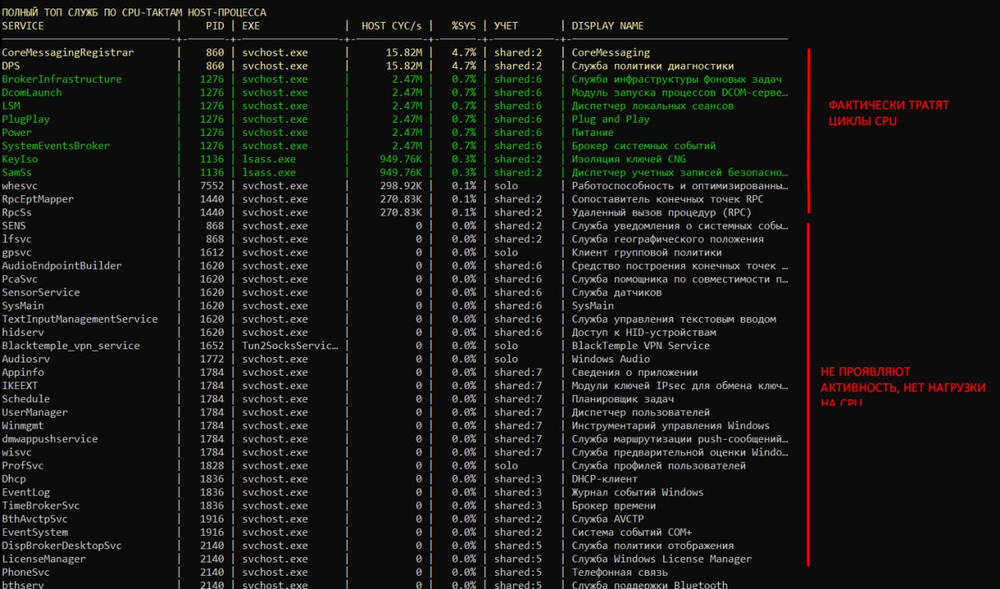
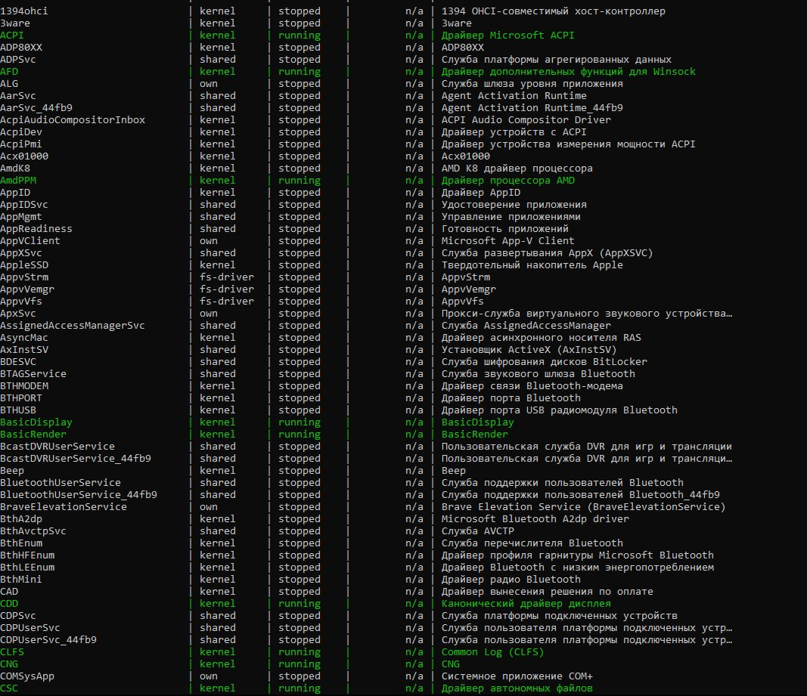

# SERVICES-CYCLE

A read-only Windows console monitor that relates Windows services to CPU cycles consumed by their host processes.





## What it monitors

- Enumerates Windows services, including service name, display name, type, state, and reported host process ID.
- Samples running processes with `QueryProcessCycleTime` and calculates an approximate cycle rate from counter deltas.
- Shows a host-process table sorted by cycle rate, a service table linked to host PIDs, and a separate list of services without a PID.
- Displays cycle rates using K/M/G/T units, the host process executable, service scope (`solo` or `shared:N`), and each host's share of sampled process cycles.
- Takes two service and process snapshots per interval so the display can refresh continuously.

## Important measurement detail

Windows reports these cycle counters for processes, not for individual services hosted inside a shared process. When several services share one PID (for example, an `svchost.exe`), each service row displays the same total cycle rate for that host. The value is not split or estimated per service. Services without a host PID show `n/a`.

`%SYS` is the host process's share of the cycle-rate deltas successfully sampled across processes. It is not the conventional CPU-utilization percentage. Cycle rates are estimates based on the configured polling interval and may be affected by sampling overhead or process access restrictions.

The program only monitors service and process activity; it does not start, stop, or reconfigure services.

## Sampling interval

By default the polling interval is 1000 ms. Pass an interval in milliseconds as the first argument; values are limited to 200-10000 ms.

```powershell
.\Services-Cycle.exe 1000
```

## Build

- Windows
- Visual Studio with the Desktop development with C++ workload
- C++20 and the Windows SDK

Open `Services-Cycle.slnx` and build the `Release|x64` configuration. The project configures this build for Intel C++ Compiler 2025 with AVX2. The `Debug|x64` configuration uses the MSVC v145 toolset.

The x64 Release configuration requests Administrator privileges. Running elevated also helps enumerate protected processes and services; the application warns when it is not elevated.

## Source layout

- `SERVICES-CYCLE/Services-Cycle.cpp` - service enumeration, process cycle sampling, attribution, and console output
- `SERVICES-CYCLE/Services-Cycle.vcxproj` - C++20 build configurations
- `host-process-cycles.jpg` and `service-inventory-no-pid.jpg` are published as the descriptive screenshots linked above.